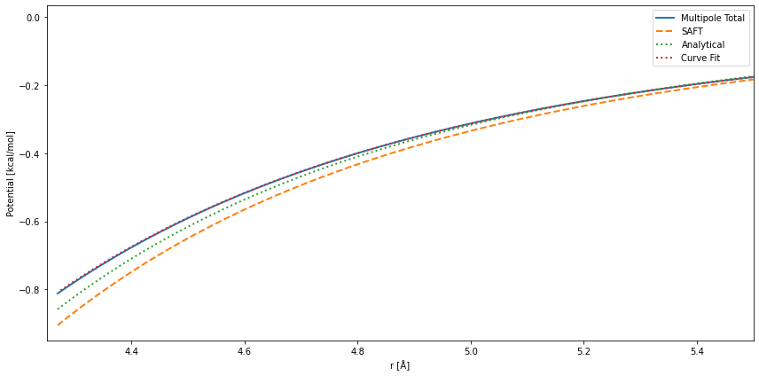
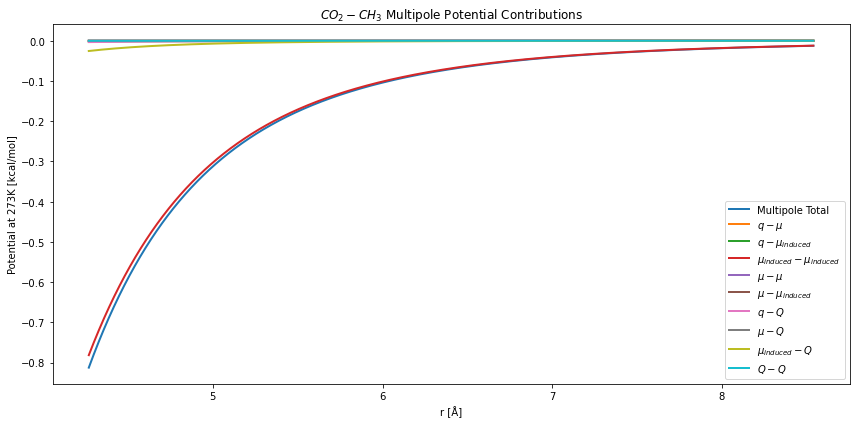
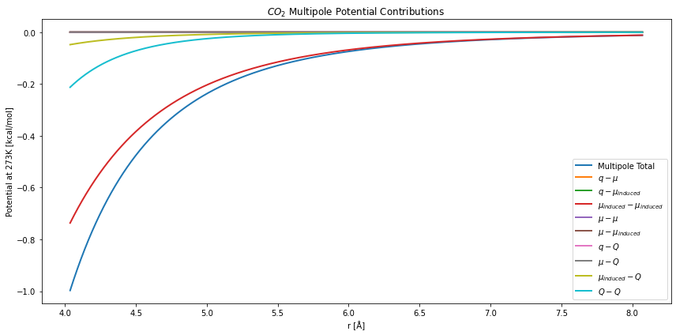
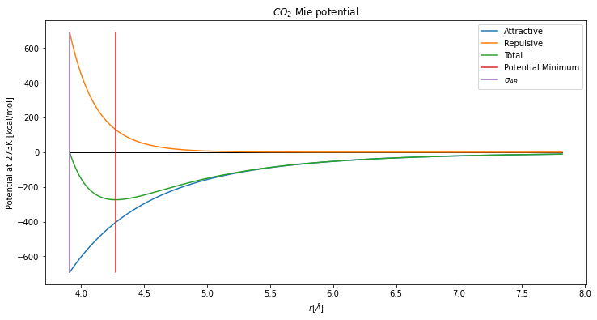
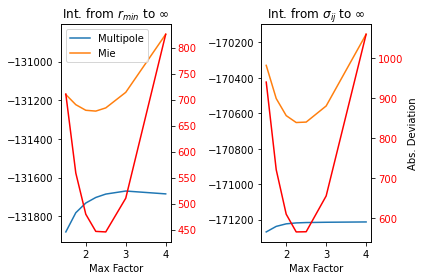

MAPSCI: How does it work?
=========================

MAPSCI is a package to estimate cross-interaction parameters of
SAFT-:math:`\gamma`-Mie using the multipole moments of bead fragments.
In this document we will walk through calculations with :math:`CO_2` and
propane where their parameters are taken from `Avendaño
2011 <dx.doi.org/10.1021/jp204908d>`__ and `Dufal
2014 <dx.doi.org/10.1021/je500248h>`__, respectively. The multipole
moments of these beads are calculated used the DFT method and basis set
combination, B3LYP/aug-cc-pVDZ.

Estimation of cross-interaction parameters is achieved in MAPSCI with
one of two methods. 1. Analytical Method: Calculation of
:math:`\epsilon_{ij}` by matching the integral from some lower limit to
infinity for the multipole and Mie potentials. 2. Curve-fitting Method:
Calculation of :math:`\epsilon_{ij}`, :math:`\lambda_{r,ij}`, and
:math:`\lambda_{a,ij}` by curve fitting the Mie potential to the
multipole potential and a consistency constraint using the van der Waals
attraction parameter.

Although we are inclined to favor the second method. This tutorial with
illustrate why.

Basic Use
---------

First, let’s define the beads library. We excluded the :math:`CH_2`
bead, because the purpose of this notebook is to simply illustrate the
use of MAPSCI. With the parameter library we calculate the
cross-interaction parameters with the Analytical and Curve-fitting
methods using the default settings. The theory behind this method is
temperature dependent and so we must also choose a temperature.

.. code:: ipython3

    bead_library = {
                    "CO2": {
                            'epsilon': 353.55, 
                            'sigma': 3.741, 
                            'lambdar': 23.0, 
                            'lambdaa': 6.66, 
                            'Sk': 1.0, 
                            'charge': 0.0, 
                            'dipole': 0.0, 
                            'quadrupole': 4.62033, 
                            'ionization_energy': 316.3969563680995, 
                            'mass': 0.04401
                           },
                   "CH3": {
                           'epsilon': 256.77,
                           'sigma': 4.0773,
                           'lambdar': 15.05,
                           'lambdaa': 6.0, 
                           'Sk': 0.57255,
                           'charge': -0.03278, 
                           'dipole': 0.068168573,
                           'quadrupole': 0.060537996, 
                           'ionization_energy': 254.80129735161324,
                           'mass': 0.01503
                          }
                   }
    keys = list(bead_library.keys())

.. code:: ipython3

    import mapsci
    temperature = 273
    cross_fit, summary_fit = mapsci.extended_combining_rules_fitting(bead_library, temperature)
    cross_anal, summary_anal = mapsci.extended_combining_rules_analytical(bead_library, temperature)
    
    print("Parameters from Curve-fitting Method\n\t", cross_fit,"\n")
    print("Parameters from Analytical Method\n\t", cross_anal)

.. parsed-literal::

    Parameters from Curve-fitting Method
    	 {'CO2': {'CH3': {'epsilon': 274.0094524271247, 'lambdar': 18.705087724553824, 'lambdaa': 6.021868741514751}}} 
    
    Parameters from Analytical Method
    	 {'CO2': {'CH3': {'epsilon': 284.79308252159484}}}

Now let’s compare the multipole potential to the Mie potential from the
standard SAFT combining rules and the two parameter sets from our
estimation methods.

.. code:: ipython3

    import matplotlib.pyplot as plt
    plt.figure(figsize=(12,6))
    
    # Plot multipole potential
    mapsci.plot_multipole_potential_from_dict(bead_library[keys[0]], 
                                              bead_library[keys[1]], 
                                              temperature=temperature,
                                              plot_terms=False,
                                              plot_opts={"linewidth": 2},
                                              show=False)
    # Plot mie potential with SAFT combining rules
    mapsci.plot_attractive_mie_potential_from_dict(bead_library[keys[0]], 
                                                   bead_library[keys[1]], 
                                                   beadAB={"epsilon": summary_anal[keys[0]][keys[1]]["epsilon_saft"]},
                                                   temperature=temperature, 
                                                   plot_opts={"label": "SAFT",
                                                              "linestyle":"--",
                                                              "linewidth": 2},
                                                   show=False)
    # Plot mie potential with Analytical method
    mapsci.plot_attractive_mie_potential_from_dict(bead_library[keys[0]], 
                                                   bead_library[keys[1]], 
                                                   beadAB=cross_anal[keys[0]][keys[1]],
                                                   temperature=temperature, 
                                                   plot_opts={"label": "Analytical",
                                                              "linestyle":":",
                                                              "linewidth": 2},
                                                   show=False)
    # Plot mie potential with Curve-fitting method
    beadAB = mapsci.mie_combining_rules(bead_library[keys[0]],bead_library[keys[1]])
    beadAB.update(cross_fit[keys[0]][keys[1]])
    mapsci.plot_attractive_mie_potential_from_dict(bead_library[keys[0]], 
                                                   bead_library[keys[1]], 
                                                   beadAB=beadAB,
                                                   temperature=temperature, 
                                                   plot_opts={"label": "Curve Fit", 
                                                              "linestyle":":",
                                                              "linewidth": 2},
                                                   show=False)
    plt.legend(loc="best")
    plt.xlim((4.25,5.5))
    plt.show()

In the plot we see that the traditional SAFT combining rules produce a
Mie potential that deviates the most from the multipole potential. The
Analytical method of predicting the energy parameter using multipole
moments improves the estimation, although the Curve-fitting is much
closer.

Next let’s look at the components of the multipole moment that
contribute to this fit.

.. code:: ipython3

    plt.figure(figsize=(12,6))
    plt.title("$CO_2-CH_3$ Multipole Potential Contributions")
    # Plot multipole potential
    mapsci.plot_multipole_potential_from_dict(bead_library[keys[0]], 
                                              bead_library[keys[1]], 
                                              temperature=temperature,
                                              plot_terms=True,
                                              plot_opts={"linewidth": 2},
                                              show=False)

Here we see the largest component is the induced-dipole/induced-dipole
interaction. The second largest component is the interactions between
dipole and quadrupole moments. In this method the induced-dipole
interaction uses the polarizability, which was fit to the provided
self-interaction Mie potential.

:math:`CO_2` has a strong quadrupole moment, but is dominated by the
induced-dipole interactions. As seen here:

.. code:: ipython3

    plt.figure(figsize=(12,6))
    plt.title("$CO_2$ Multipole Potential Contributions")
    # Plot multipole potential
    mapsci.plot_multipole_potential_from_dict(bead_library[keys[0]], 
                                              bead_library[keys[0]], 
                                              temperature=temperature,
                                              plot_terms=True,
                                              plot_opts={"linewidth": 2},
                                              show=False)

Choosing the Bounds
-------------------

The results we’ve achieved with our default parameters are encouraging,
but how did we choose them? Recall that each method relies on
restricting the range of density values. For the Analytical method, each
potential is integrated from a minimum bound of integration to infinity.
Here we will focus on the Curve-fitting method, which involves defining
the lower and upper bound for curve fitting. Setting these bounds will
dictate the Mie potential attractive exponent, as the various multipole
moments vary in their dependence on distance between beads. For
interactions between dipole and induced-dipole moments there is a
dependence of :math:`r^{-6}`. Interactions with these and quadrupole
moments follows a dependence of :math:`r^{-8}` and with charges the
dependence is :math:`r^{-4}`. At short distances this the total
multipole potential will be dominated by :math:`r^{-6}` and at longer
distances by :math:`r^{-4}`.

In response to this let’s first take a look at the Mie potential. It is
comprised of a repulsive and an attractive potential, although in this
work we focus on comparing the multipole potential to the attractive Mie
potential.

.. code:: ipython3

    rmin = mapsci.mie_potential_minimum(beadAB)
    r = mapsci.calc_distance_array(beadAB, max_factor=2, lower_bound="sigma")
    phi_attractive = mapsci.calc_mie_attractive_potential(r, beadAB)
    phi_repulsive = mapsci.calc_mie_repulsive_potential(r, beadAB)
    
    plt.figure(figsize=(12,6))
    plt.title("$CO_2$ Mie potential")
    plt.plot([r[0],r[-1]],[0,0],"k",linewidth=1)
    plt.plot(r,phi_attractive,label="Attractive")
    plt.plot(r,phi_repulsive,label="Repulsive")
    plt.plot(r,phi_repulsive+phi_attractive,label="Total")
    plt.plot([rmin,rmin],
             [min(phi_attractive), max(phi_repulsive)], 
             label="Potential Minimum")
    plt.plot([beadAB["sigma"],beadAB["sigma"]],
             [min(phi_attractive), max(phi_repulsive)], 
             label="$\sigma_{AB}$")
    plt.xlabel("$r [\AA]$")
    plt.ylabel("Potential at {}K [kcal/mol]".format(temperature))
    plt.legend(loc="best")

.. parsed-literal::

    <matplotlib.legend.Legend at 0x10eeea1d0>

Two natural choices for the Mie potential are (1) the size parameter for
the mixed interaction, :math:`\sigma_{AB}` and (2) the minimum of the
Mie potential. However, notice that the repulsive potential decays
faster than the attractive potential. Thus, a third option is a
“tolerance” of the ratio of the repulsive term over the attractive term.
Since the attractive potential begins dominating the behavior of the Mie
potential at :math:`r_{min}`, our default is to start there.

The maximum density is defined to be a multiple of the lower bound,
:math:`max\_factor`. As discussed previously, the potential shifts its
exponential behavior as distance increases. It follows then, that if
:math:`max\_factor` is too large, then the crucial behavior close to the
potential well won’t be represented correctly. Yet, if the range in too
small, then the behavior at long distances isn’t captured. We can
compare each of these situations by calculating the integral from the
lower limit to infinity. We then plot the difference between the
integral of the attractive Mie potential with the multipole moment.

.. code:: ipython3

    mapsci.plot_mie_multipole_integral_difference(bead_library[keys[0]], 
                                                  bead_library[keys[1]], 
                                                  temperature,
                                                  show=False)

Notice that despite the lower bound (i.e. :math:`\sigma_{AB}` or
:math:`r_{min}`) the least error between the potentials is achieved with
a :math:`max\_factor` just over two. In addition, the gap is smallest
for :math:`r_{min}`. Hence, our default fitting rangs is from
:math:`r_{min}` to :math:`2r_{min}`.
